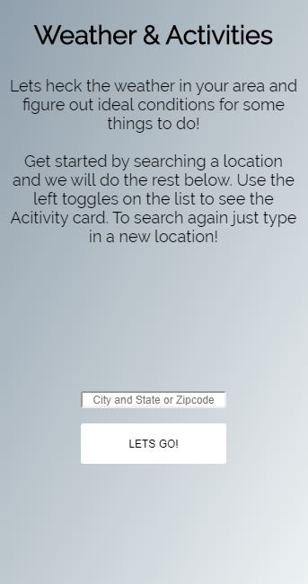

WEATHER ACTIVITIES API HACK Rev3 3/7/2020

https://ttilley02.github.io/Weather_and_Activities/

##Objective
To access multiple API and assist the user in finding out/suggesting which activities they can do given the weather

##Process
The app first gets the user's query for a U.S. location(via zipcode or city/address).The app then uses that information to fetch weather statistics(forecast) on the national weather service API and reports back to the user with a forecast for the current hour.

Upon fetching the information and displaying it to the user, the app compares the current forecast pulled with ideal temps for activities in our database.
It then suggests activities based on what is deemed as ideal weather.

The user then can click on each activity thats opens up a larger activity card featuring a picture and
a Duckduckgo search on places nearby to do said activity.

##Technologies Used

HTML,CSS,Jquery,Javascript

 

